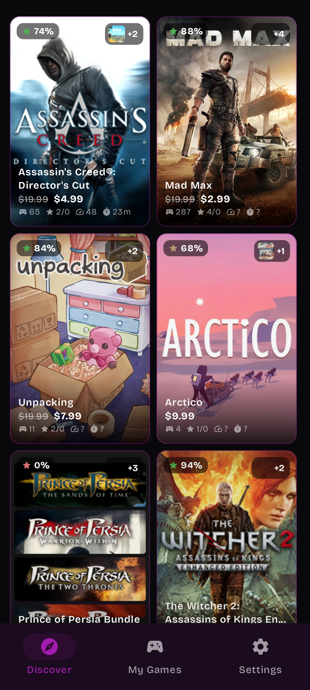
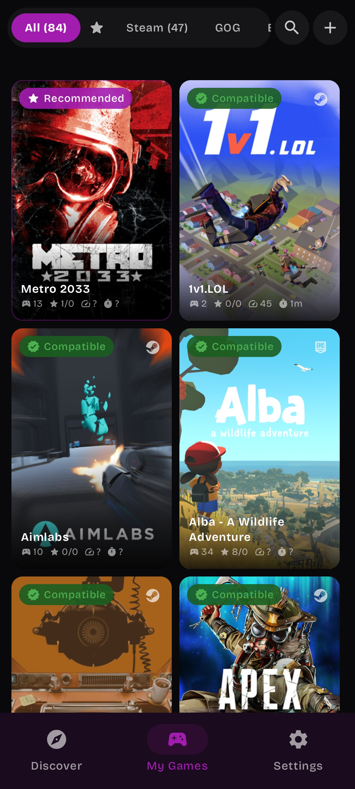
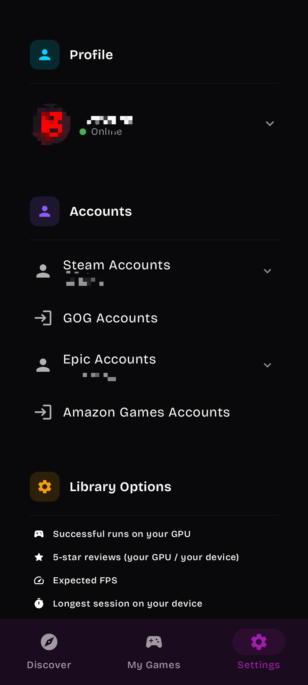

<p align="center">
  
</p>

<div align="center">

# HyperNative

**A privacy-focused, lightweight, and streamlined fork of GameNative.**

*Play your PC games from Steam, Epic Games, GOG, and Amazon directly on Android — natively, offline, and telemetry-free.*

[](LICENSE)
[](https://github.com/utkarshdalal/GameNative)
[](https://github.com/Compute64bits/HyperNative/releases/latest)

</div>

---

**HyperNative** is a community-driven fork of [GameNative](https://github.com/utkarshdalal/GameNative), developed and maintained with AI-assisted workflows. It focuses on providing a clean, privacy-respecting, and optimized environment to run your PC game libraries locally on Android.

---

## ✨ Key Improvements & Features

* 👥 **Multi-Account Management**: Seamlessly switch between multiple accounts across Steam, Epic Games, GOG, and Amazon Games.
* 🖥️ **Smart Display Scaling**: Automatic screen-size detection with adaptive full-screen support for edge-to-edge gaming.
* 🎨 **Refined Interface**: Distraction-free, modern UI built for fast touch navigation and quick access to your local library.
* 🛡️ **Zero Telemetry & Tracking**: Stripped of all third-party analytics (PostHog, crash logs, diagnostic trackers). Your gameplay, account keys, and metrics remain strictly on-device.
* 🧹 **Clean File System**: Resolved the critical upstream bug that generated thousands of ghost/empty directories on ./Downloads internal storage, preventing storage clutter and media scanner slowdowns.
* ⚡ **Optimized Builds**: Cleaned-up dependencies, reduced overhead, and fixed compiler warnings for leaner runtime execution.

---

## 🤖 Development & Maintenance

HyperNative uses automated AI-assisted development pipelines to accelerate maintenance, clean legacy code, and triage issues:

* **Compiler Cleanliness**: Elimination of legacy Gradle/NDK build warnings and dead code paths.
* **Storage Sanitation**: Fixed improper directory creation routines that previously flooded the ./Downloads user's file system with empty folders.
* **Assisted Tooling**: Refactoring and feature implementation refined using modern LLM pipelines (Gemini Flash 3.7 Extended and Mimo v2.5 pro).

---

## 📸 Screenshots

<p align="center">
  
  
  
</p>

---

## 📥 Installation

Download the latest stable APK directly from GitHub Releases:
👉 **[Download Latest APK](https://github.com/Compute64bits/HyperNative/releases/latest)**

---

## 🛠️ Building from Source

### Prerequisites

* **JDK 21** (e.g., Eclipse Temurin 21)
* **Android SDK** (Platforms 35/36, CMake, NDK r26+)

### Build Steps

1. **Clone the repository:**
   ```bash
   git clone https://github.com/Compute64bits/HyperNative.git
   cd HyperNative
   ```

2. **Configure environment:**
   ```bash
   echo "sdk.dir=$HOME/Android/Sdk" > local.properties
   ```

   *(Optional) Add a SteamGridDB API key for automatic cover scraping:*
   ```bash
   echo "STEAMGRIDDB_API_KEY=your_api_key_here" >> local.properties
   ```


3. **Compile the APK:**
   * **Debug build:**
   ```bash
   ./gradlew :app:assembleModernDebug --no-daemon -Dorg.gradle.jvmargs="-Xmx3584m"
   ```

   * **Release build (Low-RAM configuration):**
   ```bash
   ./gradlew :app:assembleModernRelease --no-daemon --max-workers=1 -Dorg.gradle.jvmargs="-Xmx3072m" -x lint -x lintVitalAnalyzeModernRelease -x test
   ```

Built binaries will be located in: `app/build/outputs/apk/modern/`

---

## 🔒 Privacy & Architecture

HyperNative treats user privacy as a non-negotiable principle:

* **No Analytics SDKs**: No analytic or telemetry libraries are packaged within the APK.
* **Zero Remote Logging**: Performance metrics (FPS, frame times), hardware IDs, and launch states are never reported outbound.
* **Isolated Credentials**: All authentication tokens and API secrets stay sandboxed in Android internal storage (`filesDir`).

---

## 📄 License & Credits

* Based on **[GameNative](https://github.com/utkarshdalal/GameNative)** by Utkarsh Dalal and contributors.
* Licensed under the **[GNU General Public License v3.0 (GPLv3)](https://www.google.com/search?q=LICENSE)**.
* Bundled components (Wine, DXVK, Mesa, Box64, FEX, etc.) remain subject to their respective open-source licenses as documented in `THIRD_PARTY_NOTICES`.

---

**Disclaimer:** *HyperNative is an independent project and is not endorsed by or affiliated with Valve, Epic Games, CD PROJEKT RED, or Amazon. All trademarks belong to their respective owners. This application is designed solely to launch legally acquired software.*
